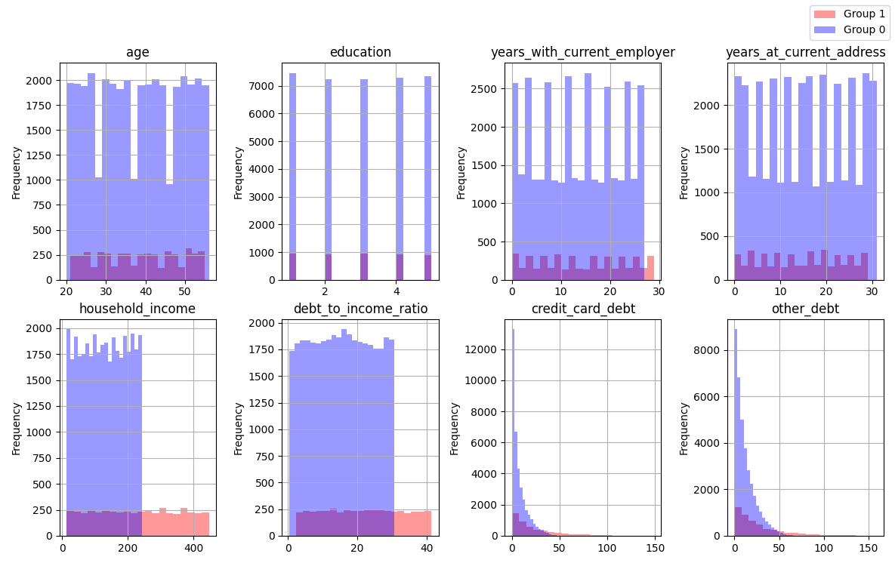
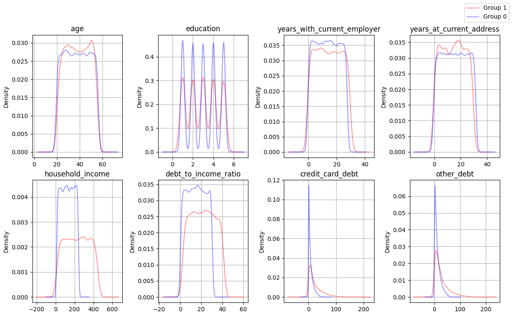
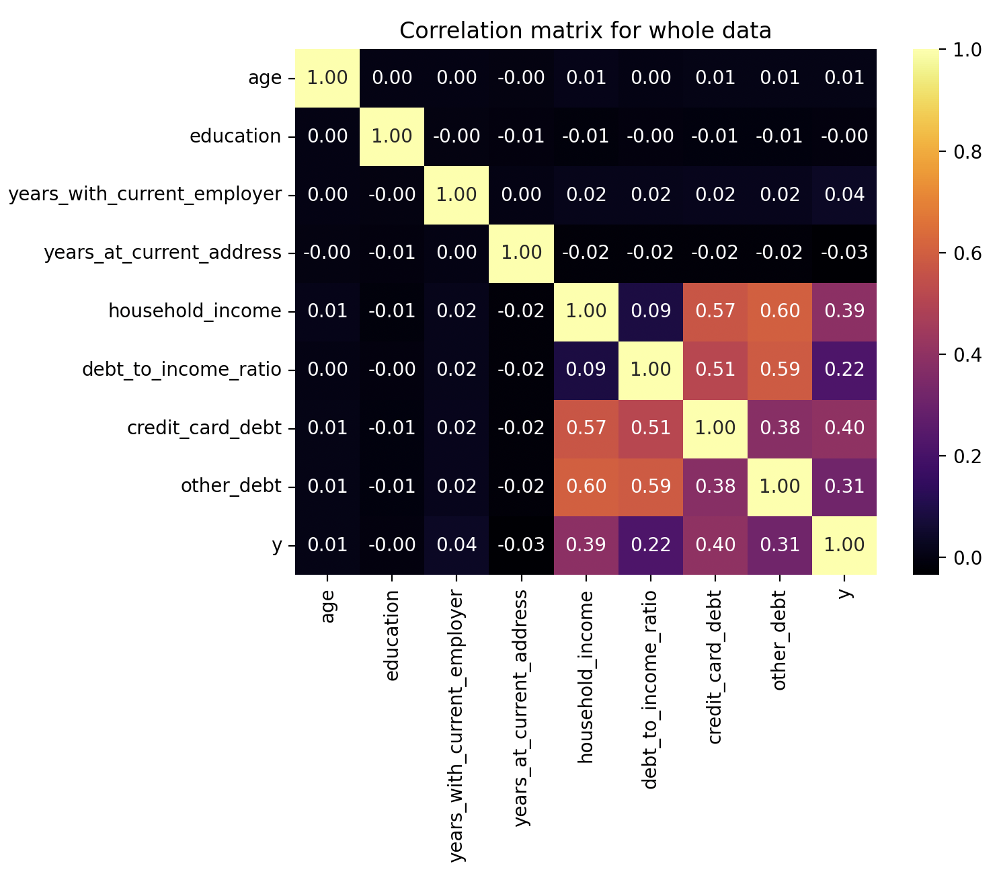

<div style="position: fixed; bottom: 20px; right: 20px; z-index: 999;">
  <a href="https://tatianakarpovap.github.io/Portfolio_Data_Analyst/" target="_self" style="padding: 10px 20px; background-color: #4CAF50; color: white; text-decoration: none; border-radius: 5px;">Main page</a>
</div>


# Project 'Credit risk score'
###### *This project is an intellectual property. When quoting, please indicate the original source*

During my first academic term, I have completed a final assignement and for the topic I have chosen to focus on the banking sector and the issues of credit risk assessment. I conducted an analysis of an open database from a repository of Chief Data Scientist at Prediction Consultants in Israel - [Roi Polanitzer (github account)](https://github.com/frm-garp). The raw data can be found [here](https://github.com/frm-garp/Logistic-Regression-in-Python--Predict-the-Probability-of-Default-of-an-Individual/blob/main/bank.csv).

# Content
1. [Problem and dataset](#title1)
    - [Problem formulation](#title2)
    - [Dataset description](#title3)
    - [Dataset transforming](#title4)
    - [Dataset statistics](#title5)
2. [Visualization](#title6)
3. [Models implementation](#title7)
   - [Logistic regression model assessment](#title8)
   - [K-Nearest Neighbors model assessment](#title9)

  
## <a id="title1">Problem and dataset</a>
### <a id="title2">Problem formulation</a>  

  Over the past four decades, there has been a consistent increase in the share of household loans and debts in GDP across most countries, highlighting the significance of credit as a reliable financial instrument according to International Monetary Fund statistic (2022).

Banks offer a wide range of credit services, with loans being a primary source of income (Miguéis V.L., Benoit D.F. and Van den Poel D. 2013). To ensure a steady flow of credit payments and avoid profit loss, banks must assess clients' credit risk. Researchers have explored Machine Learning techniques to develop accurate credit risk assessment models, leading to promising methods for evaluating default probabilities (Florez-Lopez R. and Ramon-Jeronimo J.M. 2014, Hooman A. et al 2016). The researchers Subburayan B. et al emphasize the inevitability of the transformation of the banking sector with the help of Machine Learning (2023)

The transformation of the banking sector through Machine Learning is emphasized, impacting areas such as quality assessment, transaction trends, and customer satisfaction, thereby enhancing customer happiness and income. Effective risk management is crucial in banking operations, improving loan portfolios, reducing credit losses, and lowering default rates. Implementation of risk-driven approaches based on Machine Learning can yield time-saving solutions and address big data challenges, with potential reputational and financial benefits.

Despite having limited information, banks must ensure the reliability of their data to develop tailored methods for assessing credit risks. From all this it follows that banks face an important problem: how to assess the credit risk for each new customer with information about their past default experience? My work provides one of possibles answer to this question.

<a id="title3">Dataset description</a>
  This research is based on a dataset extracted from a [Roi Polanitzer's github repository](https://github.com/frm-garp/Logistic-Regression-in-Python--Predict-the-Probability-of-Default-of-an-Individual/blob/main/bank.csv). It contains 700 samples with 9 features. These features are:
1. age – customer age, years;
2. education – customer education level;
3. years_with_current_employer – time with current employer, years;
4. years_at_current_address – time at the current address, years;
5. household_income – annual income,  in thousands of USD;
6. debt_to_income_ratio – debt-to-income ratio, %;
7. credit_card_debt – debt on the credit card, in thousands of USD;
8. other_debt – other debts,  in thousands of USD;
9. y (or 'default' feature) – indicates whether a customer defaulted in the past if = 1 than yes, if = 0 does not.

The analysis is based on the hypothesis that unpaid debts in the past leads to unpaid debts in the future. That is why the ‘default’ variable is dependent in the models in this project. Moreover, it presents two classes of customers: reliable if ‘default’=1 and unreliable if ‘default’=0.

All further calculations are made in Python. The data is partly presented below. 

### <a id="title4">Dataset transforming</a>
  A few steps are made in order to detect errors and inaccuracies and as a result having clean data for further analysis.
- to detect Nan values;
- to detect abnormal values;
- to check all values are with expected type.

```python
    print(dataset.head())
```

Output
<table>
    <tr>
        <th>#</th>
        <th>loan_applicant_id</th>
        <th>age</th>
        <th>education</th>
        <th>years_with_current_employer</th>
        <th>years_at_current_address</th>
        <th>household_income</th>
        <th>debt_to_income_ratio</th>
        <th>credit_card_debt</th>
        <th>other_debt</th>
        <th>y (default)</th>
    </tr>
    <tr>
        <td>0</td>
        <td>191</td>
        <td>44</td>
        <td>university.degree</td>
        <td>10</td>
        <td>20</td>
        <td>192</td>
        <td>12.116645</td>
        <td>14.377313</td>
        <td>8.886645</td>
        <td>1</td>
    </tr>
    <tr>
        <td>1</td>
        <td>34318</td>
        <td>34</td>
        <td>high.school</td>
        <td>3</td>
        <td>18</td>
        <td>57</td>
        <td>14.264229</td>
        <td>5.137880</td>
        <td>2.992730</td>
        <td>0</td>
    </tr>
    <tr>
        <td>2</td>
        <td>14932</td>
        <td>45</td>
        <td>university.degree</td>
        <td>14</td>
        <td>24</td>
        <td>212</td>
        <td>7.285681</td>
        <td>10.460306</td>
        <td>4.985339</td>
        <td>0</td>
    </tr>
    <tr>
        <td>3</td>
        <td>2776</td>
        <td>33</td>
        <td>illiterate</td>
        <td>12</td>
        <td>5</td>
        <td>418</td>
        <td>11.386272</td>
        <td>3.040189</td>
        <td>44.554429</td>
        <td>1</td>
    </tr>
    <tr>
        <td>4</td>
        <td>11915</td>
        <td>20</td>
        <td>basic</td>
        <td>4</td>
        <td>19</td>
        <td>122</td>
        <td>28.418494</td>
        <td>14.560450</td>
        <td>20.110112</td>
        <td>0</td>
    </tr>
</table>

No significant errors or missing values were found. If any were discovered, they can be replaced using one of the following methods: 
1) Completely removing such objects from the data set (I do not recommend this method);
2) Replacing each value with the mean of the sample.

```python
    print(dataset.info())
```
Output
```
    <class 'pandas.core.frame.DataFrame'>
RangeIndex: 41188 entries, 0 to 41187
Data columns (total 10 columns):
 #   Column                       Non-Null Count  Dtype  
---  ------                       --------------  -----  
 0   loan_applicant_id            41188 non-null  int64  
 1   age                          41188 non-null  int64  
 2   education                    41188 non-null  object 
 3   years_with_current_employer  41188 non-null  int64  
 4   years_at_current_address     41188 non-null  int64  
 5   household_income             41188 non-null  int64  
 6   debt_to_income_ratio         41188 non-null  float64
 7   credit_card_debt             41188 non-null  float64
 8   other_debt                   41188 non-null  float64
 9   y                            41188 non-null  int64  
dtypes: float64(3), int64(6), object(1)
memory usage: 3.1+ MB
```
It is seen that the database contains 41,188 records. This is a significant amount from which to draw representative conclusions. All the data is in the expected format. At the same time, I have a desire to standardize the "education" feature. It is made as:

```python
def educational_coding(dataset):
    education_mapping = {
        'university.degree': 1,
        'high.school': 2,
        'illiterate': 3,
        'basic': 4,
        'professional.course': 5
    }

    dataset['education'] = dataset['education'].replace(education_mapping)
    return(dataset)
```

### <a id="title5">Dataset statistics</a> 
Now, let us take a look at some descriptive statistics to form the big picture of the database:

```python
    print(dataset.describe().to_string())
```
Output
```
Whole dataset description
              age  education  years_with_current_employer  years_at_current_address  household_income  debt_to_income_ratio  credit_card_debt  other_debt
count  41188.000  41188.000                    41188.000                 41188.000         41188.000             41188.000         41188.000   41188.000
mean      38.008      2.993                       13.550                    15.385           139.707                16.224             9.577      13.758
std       10.624      1.419                        8.145                     9.184            81.688                 9.191            12.409      14.597
min       20.000      1.000                        0.000                     0.000            14.000                 0.400             0.006       0.022
25%       29.000      2.000                        6.000                     7.000            74.000                 8.452             1.853       3.784
50%       38.000      3.000                       14.000                    15.000           134.000                16.105             5.311       9.154
75%       47.000      4.000                       21.000                    23.000           196.000                23.731            12.637      18.907
max       56.000      5.000                       29.000                    31.000           446.000                41.294           149.016     159.198
```
The boolean value of Y can be ignored, since statistics do not provide any useful information. This value is analysed later.
I drawn a portrait of an average bank customer. He/she is 38 years old and most likely illiterate, also he/she has not changed jobs in 13 years and has been living in the same place for more than 15 years. The average salary  is $139,700 per year, but about 16% of that amount is in debt, including about $9,600 in credit card debt and $13,800 in other debt.

The median (50%) also indicates that the variables are mostly evenly distributed, while for credit_card_debt and other_debt the average is shifted to the second half of the dataset.

I assume that function ‘describe()’ provides not enough details, and I decided to create its own table with more coefficients: Harmonic Mean, Range, Mode, Skewness, Kurtosis.

Output
```
                         age  education  years_with_current_employer  years_at_current_address  household_income  debt_to_income_ratio  credit_card_debt  other_debt
Harmonic Mean        34.830      2.178                        0.000                     0.000            82.480                 7.525             1.172       3.149
Range                36.000      4.000                       29.000                    31.000           432.000                40.894           149.010     159.176
Mode                 43.000      1.000                        2.000                    28.000           201.000                12.117            14.377       8.887
Skewness              0.002      0.003                        0.015                     0.004             0.759                 0.148             3.279       2.558
Kurtosis             -1.206     -1.307                       -1.192                    -1.199             0.910                -0.875            16.972      10.950
```

- Harmonic Mean is very different from the Mean for household_income, debt_to_income_ratio, credit_card_debt, and other_debt. This indicates that there are extreme values in the data. If Harmonic Mean = 0, means there is a zero value in the data, so, cannot say anything about the difference for such variables. 
- Range and Standard Deviation together clearly indicate that there is a significant variation in the data. I believe this is because of the large number of objects which represent different groups of people.
- Mode shows the most common values. They are seen from the table, does not require lots of comments  
- Skewness is close to zero, which indicates that there is no significant asymmetry in the distribution of education levels. Except for household_income, credit_card_debt, and other_debt it is positive and above zero, meaning the data distribution shows a right-skewed asymmetry, which means there is a longer tail on the right. This is typical of financial indicators, in which there are no upper limits on values. For example, there is an age limit and, accordingly, a time limit for living/working at one location.
- Kurtosis also mostly have a very big and negative number, means the curves are more flatter vertices and lighter tails. Household_income, credit_card_debt, and other_debt have high sharp peaks and long outliers.

## <a id="title6">Visualization</a> 
To learn more about the behavior patterns within reliable and unreliable customers, the metrics of these two groups is considered. Moreover, number of observations in a group of reliable clients (Y=0) is almost 8 times more than in an unreliable one (Y=1).
```
Value 'y' (default)
0    36548
1     4640
Name: count, dtype: int64
```
Next, two groups of data are analyzed separately, and their descriptive statistics are presented further. In short, the means and standard deviation values between groups are the same, except for the group of clients with debt. For them the indicators are significantly higher.

<details>
  <summary>Dataset of reliable clients description</summary>

  ```python
    print(dataset_0.describe().to_string())
  ```


Output
```
              age  education  years_with_current_employer  years_at_current_address  household_income  debt_to_income_ratio  credit_card_debt  other_debt
count  36548.000  36548.000                    36548.000                 36548.000         36548.000             36548.000         36548.000   36548.000
mean      37.976      2.995                       13.448                    15.498           128.301                15.515             7.811      12.127
std       10.686      1.420                        8.063                     9.246            66.318                 8.665             8.427      11.344
min       20.000      1.000                        0.000                     0.000            14.000                 0.400             0.006       0.022
25%       29.000      2.000                        6.000                     7.000            71.000                 8.041             1.651       3.552
50%       38.000      3.000                       13.000                    16.000           128.000                15.530             4.724       8.480
75%       47.000      4.000                       20.000                    24.000           186.000                22.935            11.126      17.334
max       56.000      5.000                       27.000                    31.000           242.000                30.600            55.344      68.666

```

</details>


<details>
  <summary>Dataset of unreliable clients description</summary>

  ```python
    print(dataset_1.describe().to_string())
  ```

Output

```
             age  education  years_with_current_employer  years_at_current_address  household_income  debt_to_income_ratio  credit_card_debt  other_debt
count  4640.000   4640.000                     4640.000                  4640.000          4640.000              4640.000          4640.000    4640.000
mean     38.261      2.980                       14.356                    14.500           229.555                21.810            23.490      26.605
std      10.112      1.411                        8.723                     8.637           124.487                11.109            24.277      26.302
min      21.000      1.000                        0.000                     0.000            14.000                 2.407             0.057       0.222
25%      29.000      2.000                        7.000                     7.000           122.000                12.293             5.807       7.537
50%      38.000      3.000                       14.000                    15.000           231.000                21.831            14.528      17.818
75%      47.000      4.000                       22.000                    22.000           336.000                31.244            33.632      36.710
max      55.000      5.000                       29.000                    29.000           446.000                41.294           149.016     159.198

```

</details>

<h5 align="center">Histogram of the distribution frequency</h5>
<p align="center">
  
</p>

From the histogram of the frequency distribution, it can be seen that Group 1, which includes unreliable customers (those who were previously identified as defaulting), is clearly inferior in terms of number. It's interesting to note that these clients tend to have household incomes above $220,000. And at the same time, many of them have a significant amount of debt on credit cards and other sources. Based on this information, I can assume that among these unreliable clients, there are a significant number of people who earn more than average and, at the same time, use borrowed funds, and these amounts also exceed average levels. 

<h5 align="center">Distribution density diagram</h5>
<p align="center">
  
</p>

Density diagrams clearly show that, for income and debts ratio, the expected values are higher for unreliable customers. There is a greater spread of data or the presence of outliers for these features. I have also noted that the distributions of credit card debt and other types of debt are not very similar. The figure also correspond with the description of Skewness and Kurtosis mentioned above. 

Now let's move on to analyzing the strength and nature of the relationship between the parameters. For these purposes, a matrix of correlations between all parameters has been calculated. It is interesting to observe how the parameters influence the dependent variable - 'Y'. However, it is not feasible to do this individually for each group, as 'Y' does not vary (for all customers 'Y' is either 0 or 1).

<h5 align="center">Correlation matrix for the whole dataset</h5>
<p align="center">
  
</p>

Due to the large data set, it is clear which parameters significantly affect the independent variable. Income growth is associated with an increase in debts and the debt-to-income ratio. However, I am not entirely sure what exactly causes people to take out loans when their income increases. Maybe some individuals are business owners who find it normal to use credit for working capital purposes. Or, perhaps it is a household where, despite rising income, the needs increase faster, for instance, due to the need for expensive purchases such as large houses, cars, or expensive educations for children.

## <a id="title7">Models implementation</a>  

For the classification task Logistic regression is chosen. It works well on large datasets. It is also easy to interpret, and can predict the probability of belonging to a class, which is useful for decision-making. The second excellent method is the K-Nearest Neighbors. Unfortunately, it is difficult to identify whether the studied data have linear dependency, so the method deals well with nonlinear dependencies between features and the target variable. On the other hand, the method may be less effective on large datasets. Despite this, it is worth trying to evaluate both models. 

The following Python libraries are used to program the modelss: train_test_split, StandardScaler, LogisticRegression, and KNeighborsClassifier. 

### <a id="title8">Logistic regression model assessment</a>  


### <a id="title9">K-Nearest Neighbor model assessment</a>
